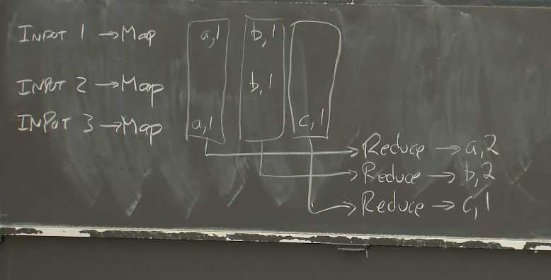

# MIT6.824

课程主页：[https://pdos.csail.mit.edu/6.824/schedule.html](https://pdos.csail.mit.edu/6.824/schedule.html)

课程翻译：[https://mit-public-courses-cn-translatio.gitbook.io/mit6-824/](https://mit-public-courses-cn-translatio.gitbook.io/mit6-824/)

## **Lab 1: MapReduce**

MapReduce是由Google设计，开发和使用的一个系统。MapReduce的思想是，应用程序设计人员和分布式运算的使用者，只需要写简单的Map函数和Reduce函数，而不需要知道任何有关分布式的事情，MapReduce框架会处理剩下的事情。



MapReduce 简单的来说，我们可以看成两个动作，一个是 `map` 将任务拆解分配，一个是 `reduce` 将结果取出组合。下图源自 MapReduce 论文：


调度器的数据结构如下：

```go
type Coordinator struct {
	nReduce        int
	MapTaskCnt     int
	ReduceTaskCnt  int
	phase          phase
	MapTaskChan    chan *Task
	ReduceTaskChan chan *Task
	Task           map[TaskType][]*Task
	mu             sync.Mutex
}
```

- `nReduce int`：表示将输入数据分割成的 Reduce 任务的数量。
- `MapTaskCnt int`：表示Map任务的数量。
- `ReduceTaskCnt int`：表示Reduce任务的数量。
- `phase phase`：这是一个自定义的枚举类型`phase`，表示当前调度器所处的阶段，可能是`MapPhase`、`ReducePhase`、`Finished`。
- `MapTaskChan chan *Task`：这是一个指向`Task`类型指针的通道，用于接收Map任务。
- `ReduceTaskChan chan *Task`：这是一个指向`Task`类型指针的通道，用于接收Reduce任务。
- `Task map[TaskType][]*Task`：这是一个map类型，键是`TaskType`，值是`Task`类型指针的切片。这个map用于存储任务，按照任务类型分类。
- `mu sync.Mutex`：这是一个互斥锁，用于保护调度器中的共享数据结构，确保并发访问的安全性。

Task的结构体如下：

```go
type Task struct {
	FileName  string
	TaskId    int
	ReduceId  int
	Status    TaskStatus
	Type      TaskType
	StartTime int64
}
```

- `FileName string`：表示任务所涉及的文件名。
- `TaskId int`：表示任务的唯一标识符。
- `ReduceId int`：表示Reduce任务的标识符。
- `Status TaskStatus`：这是一个自定义的枚举类型`TaskStatus`，表示任务的状态，可能是
*`Waiting`*、*`Running`*、*`Finished` 。*
- `Type TaskType`：这是一个自定义的枚举类型`TaskType`，表示任务的类型，可能是`MapTask`或`ReduceTask`。
- `StartTime int64`：表示任务的开始时间，以Unix时间戳形式存储。

实现流程如下：

1. **读取输入文件**：
   
    首先，调度器会读取输入文件，确定nReduce的数量
    
2. **Map任务分发**：
   
    调度器将Map任务分发给空闲的工作者。每个Map任务负责读取一部分输入数据，并生成中间键值对（key-value pairs）。
    
3. **Map任务执行**：
   
    每个Map工作者执行分配给它们的Map任务，对其负责的输入数据进行处理，并生成中间键值对。
    
4. **中间键值对合并**：
   
    中间键值对需要按照键进行排序和合并，以便后续的Reduce阶段能够有效地处理数据。
    
5. **Reduce任务分发**：
   
    等到所有map任务结束后，开始Reduce任务的分发。调度器将Reduce任务分发给空闲工作者。每个Reduce任务负责处理特定的中间键值对，执行Reduce操作，并生成最终的输出。
    
6. **Reduce任务执行**：
   
    每个Reduce工作者执行分配给它们的Reduce任务，对其负责的中间键值对进行Reduce操作，并生成最终的输出。
    
7. **输出结果**：
   
    最后，将Reduce任务生成的输出结果写入输出文件中，以完成整个分布式处理过程。
    

## **Lab 2: Raft**

在完成raft实验中，理论上如果能严苛遵循Figure2，是可以完美复刻raft协议的。

raft结构体定义如下：

```go
type Raft struct {
	mu        sync.Mutex          // Lock to protect shared access to this peer's state
	peers     []*labrpc.ClientEnd // RPC end points of all peers
	persister *Persister          // Object to hold this peer's persisted state
	me        int                 // this peer's index into peers[]
	dead      int32               // set by Kill()

	// Your data here (2A, 2B, 2C).
	// Look at the paper's Figure 2 for a description of what
	// state a Raft server must maintain.
	ElectionTimer  *time.Timer
	HeartbeatTimer *time.Timer

	// Persistent state on all servers
	State       state
	CurrentTerm int
	VotedFor    int
	Log         []LogEntry
	apply       chan ApplyMsg
	// Volatile state on all servers
	CommitIndex int
	LastApplied int // 用于记录已经被应用到状态机的最后一条日志索引

	// Volatile state on leaders
	NextIndex  []int
	MatchIndex []int

	LastIncludeIndex int // 快照包含的最后的日志索引
	LastIncludeTerm  int
	LastLogIndex     int // len(log)
}
```

完全遵守了Figure2中的要求


### **实现 leader 选举 (2A)**

Raft 定义了三种角色`State`：**领导者（Leader）**、**跟随者（Follower）** 和 **候选人（Candidate）**。

- **领导者**：领导者是 Raft 中最重要的角色之一，负责管理整个集群的操作。领导者负责接收客户端的请求，并将它们复制到其他节点上，以确保数据的一致性。领导者还负责在集群中的节点之间进行心跳通信，以维持自己的领导地位。
- **跟随者**：跟随者是 Raft 中的普通节点角色，它们通常处于被动状态，只响应来自领导者或候选人的请求。跟随者接收来自领导者的日志条目并复制它们，同时参与选举过程以选择新的领导者。
- **候选人**：当一个节点希望成为新的领导者时，它会进入候选人状态。候选人发起选举并请求其他节点投票支持自己成为新的领导者。如果候选人获得了大多数节点的选票，它将成为新的领导者。如果在选举超时时间内没有获得足够的选票，候选人会重新开始新一轮的选举。

领导者会通过周期性地向跟随者发送心跳包来维持自己的统治地位。每个跟随者都会有一个**选举超时时间**`ElectionTimer`，这个时间是随机的（如 150-300 ms），每次接收到心跳包之后，跟随者都会重置该超时时间。如果在超时之前没有收到心跳包，跟随者就会判定领导者已下线，此时跟随者就会转变为候选人，开始准备竞选。

当跟随者变成候选人时，邀请所有其他节点为自己投票。得票超一半节点数，候选人就竞选成功。如果在下一轮选举超时时间结束时还未选出领导者，该候选人就会宣告这一轮竞选失败，会等一段时间之后再参与竞选。

但节点成为领导者后，会不断地周期性地发送心跳包`HeartbeatTimer`控制跟随者。同时候选人的投票邀请也会重置跟随者的请求超时时间。

Raft 定义了 **任期（Term）** 这一概念，**所有节点都会有 `currentTerm` 这个属性，就是该节点当前所处的任期**。`**VotedFor**` 表示在这次任期中投票的对象。

**选举规则：**

1. **每一轮任期中，只会出现一位领导者，或者没有领导者**。
2. **当选举计时器超时，开始进入新的任期**。
3. **任何节点收到任期比自身任期大的请求时，需要马上跟随对方并更新自己的任期**。
4. **任何节点收到任期等于自身任期的数据追加请求时，需要马上跟随对方**。
5. **在一轮任期的选举中，任何一个节点都只能投给一个候选人**。
6. **如果收到任期比自身小的请求直接丢弃，否则必须回复**。

### **实现日志功能 (2B)**

日志复制是 raft 算法的核心，在本部分中，我们需要完善 Leader 和 Follower 节点的相关代码，来实现 `AppendEntries` 推送日志条目的相关功能。

1. **日志追加**：在领导者节点上，实现日志追加功能`Start()`。当领导者接收到客户端的请求时，将这些请求转化为日志条目，并追加（append）到自己的日志中。同时，将这些日志条目发送
`askForAppend()`给其他跟随者节点，以便它们也复制这些日志。
2. **日志复制**：在跟随者节点上，实现日志复制功能`AppendEntries()`。跟随者接收到领导者发送的日志条目后，将其追加到自己的日志中。保持所有节点的日志一致性。
3. **日志提交**：一旦大多数节点复制了某个日志条目，领导者可以将这个日志条目标记为已提交，更新`CommitIndex`，并将其应用到状态机中`applyLogsLoop()`。这样就保证了该日志条目被所有节点接受。

### **实现持久化 (2C)**

每当 Raft 的需持久化状态发生改变时，将其写入硬盘，并在重启之后从硬盘中读取出相关的状态信息。在Figure2中定义了那些字段要被持久化。在本部分中，我们需要完成 `raft.go` 中的 `persist()` 和 `readPersist()` 方法来实现持久化状态的保存和恢复。

**持久化序列化和反序列化实现**

```go
func (rf *Raft) persist() {
	// Your code here (2C).
	w := new(bytes.Buffer)
	e := labgob.NewEncoder(w)
	e.Encode(rf.CurrentTerm)
	e.Encode(rf.VotedFor)
	e.Encode(rf.Log)
	e.Encode(rf.LastIncludeIndex)
	e.Encode(rf.LastIncludeTerm)
	e.Encode(rf.LastLogIndex)

	raftstate := w.Bytes()
	rf.persister.Save(raftstate, nil)
}

func (rf *Raft) readPersist(data []byte) {
	if data == nil || len(data) < 1 { // bootstrap without any state?
		return
	}
	// Your code here (2C).
	rf.mu.Lock()
	defer rf.mu.Unlock()
	r := bytes.NewBuffer(data)
	d := labgob.NewDecoder(r)
	var currentTerm int
	var votedFor int
	var log []LogEntry
	var lastIncludeIndex int
	var lastIncludeTerm int
	var lastLogIndex int
	if d.Decode(&currentTerm) != nil ||
		d.Decode(&votedFor) != nil ||
		d.Decode(&log) != nil ||
		d.Decode(&lastIncludeIndex) != nil ||
		d.Decode(&lastIncludeTerm) != nil ||
		d.Decode(&lastLogIndex) != nil {
		Debug(dError, "S%d read persist error", rf.me)
	} else {
		rf.CurrentTerm = currentTerm
		rf.VotedFor = votedFor
		rf.Log = log
		rf.LastIncludeIndex = lastIncludeIndex
		rf.LastIncludeTerm = lastIncludeTerm
		rf.LastLogIndex = lastLogIndex
	}
}
```

**持久化时机选择**

只要涉及到 `log`, `currentTerm` 和 `votedFor` 中任意一个变量内容发生变化，我们就需要执行持久化。

**持久化恢复**

在`Make()`函数中，们需要读取出相应的内容，应用到我们的 `Raft` 结构体中。